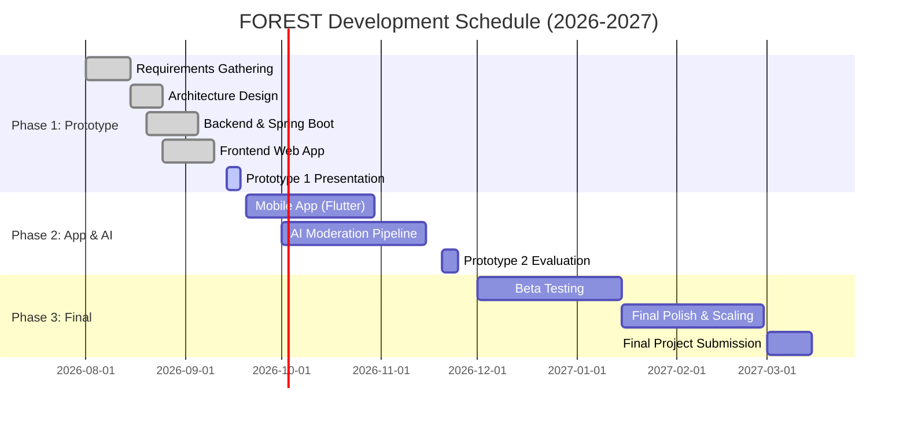

# FOREST Project Schedule

```mermaid
gantt
    title FOREST Development Schedule (2026-2027)
    dateFormat  YYYY-MM-DD
    section Phase 1: Prototype
    Requirements Gathering     :done,    des1, 2026-08-01, 2026-08-15
    Architecture Design        :done,    des2, 2026-08-15, 2026-08-25
    Backend & Spring Boot      :done,    dev1, 2026-08-20, 2026-09-05
    Frontend Web App           :done,    dev2, 2026-08-25, 2026-09-10
    Prototype 1 Presentation   :active,  mil1, 2026-09-14, 2026-09-18

    section Phase 2: App & AI
    Mobile App (Flutter)       :         dev3, 2026-09-20, 2026-10-30
    AI Moderation Pipeline     :         dev4, 2026-10-01, 2026-11-15
    Prototype 2 Evaluation     :         mil2, 2026-11-20, 2026-11-25

    section Phase 3: Final
    Beta Testing               :         test1, 2026-12-01, 2027-01-15
    Final Polish & Scaling     :         dev5, 2027-01-15, 2027-02-28
    Final Project Submission   :         mil3, 2027-03-01, 2027-03-15
```
